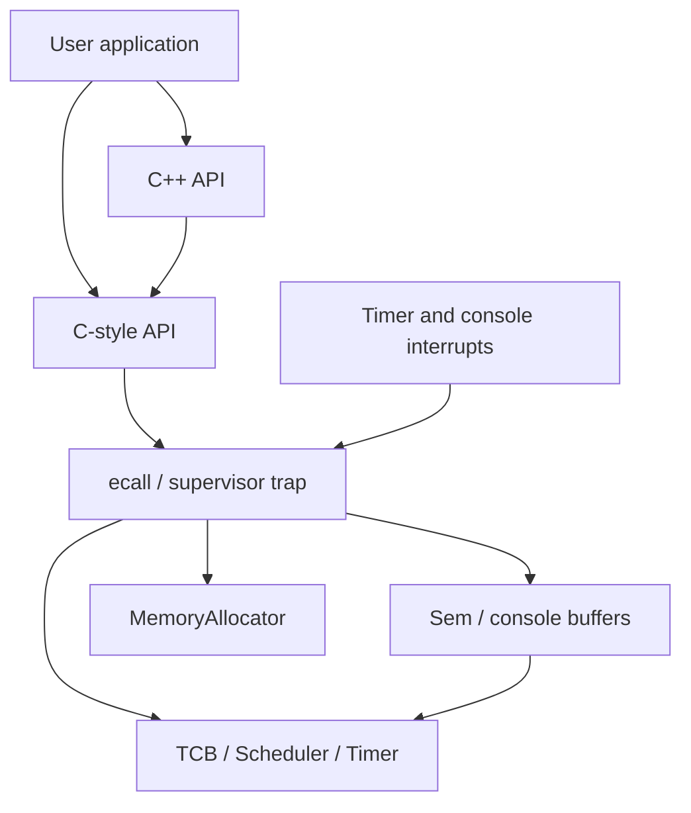

# RISC-V Multithreaded Kernel


[](LICENSE)

An educational **64-bit RISC-V operating system kernel** implementing preemptive threads, counting semaphores, dynamic memory allocation, sleeping, and buffered console I/O in **freestanding C++11 and assembly**.

Developed for **Operating Systems 1** at the **School of Electrical Engineering, University of Belgrade**, using the supplied course platform libraries.

[Architecture](os1%20project/project-base/docs/architecture.md) · [Class reference](os1%20project/project-base/docs/README.md) · [System calls](os1%20project/project-base/docs/api/CApi.md) · [Build and testing](os1%20project/project-base/docs/build-and-testing.md) · [Implementation notes](os1%20project/project-base/docs/implementation-notes.md)

## Features

| Subsystem | Implementation |
| --- | --- |
| Threads | Separate stacks, thread control blocks, voluntary dispatch, and timer-driven preemption |
| Scheduling | FIFO ready queue with round-robin scheduling and a default two-tick time slice |
| Synchronization | Blocking counting semaphores and multi-permit wait/signal extensions |
| Memory | First-fit allocation, block splitting, adjacent-region coalescing, and slot pools for kernel objects |
| Timing | Sleep/wakeup through a relative-delay list; periodic callbacks followed by relative sleeps |
| Console | Interrupt-driven input; buffered output drained by a worker that polls device readiness |
| Interfaces | C-style system calls and C++ `Thread`, `Semaphore`, `PeriodicThread`, and `Console` wrappers |
| Reclamation | A collector thread releases finished TCBs and their stacks |

## Architecture

The application and kernel are statically linked into one image and **share an address space**. User thread bodies execute in U-mode, and system calls enter S-mode through `ecall`. This demonstrates privilege transitions without implementing separate process address spaces.



Trap entry saves registers on the calling thread's stack. A blocking service can suspend that kernel call chain while another thread runs; resumption eventually returns through `sret`. Direct kernel-thread operations also require synchronization because the console and collector bodies execute with interrupts enabled.

The supplied runtime provides startup and hardware support. The build targets QEMU's `virt` machine with one CPU and 128 MiB of RAM. There is no filesystem, executable loader, networking stack, or GUI.

## Build and run

From the repository root:

```bash
cd "os1 project/project-base"
make
make qemu
```

Requirements: GNU Make, a compatible RISC-V GCC/G++ and binutils toolchain, and `qemu-system-riscv64`. The Makefile detects supported prefixes; an explicit prefix is also accepted:

```bash
make TOOLPREFIX=riscv64-unknown-elf-
make qemu TOOLPREFIX=riscv64-unknown-elf-
```

The build produces `kernel` and `kernel.asm`. `make clean` removes generated output. The `qemu-gdb` target requires a `.gdbinit.tmpl-riscv` file that is absent from the supplied archive. See the [build guide](os1%20project/project-base/docs/build-and-testing.md) for details.

## Tests

At the initial prompt, enter a test number followed by Enter:

| Options | Coverage |
| --- | --- |
| 1–2 | C-style and C++ threads with explicit dispatch |
| 3–4 | Producer/consumer synchronization |
| 5–6 | Sleep, preemption, and buffered I/O |
| 7 | Privileged-instruction attempt from a user thread; expected guest termination |
| 8 | Matrix row workers synchronized by a semaphore; expected total: 28 |
| 9 | Placeholder only; no paired-thread test runs |

Additional experiments live in `myTests/`. The [testing guide](os1%20project/project-base/docs/build-and-testing.md) lists their entry points and limitations. Test 8 uses completion signaling; the kernel has no `Thread::join()` API.

## Repository guide

| Path | Contents |
| --- | --- |
| `os1 project/project-base/docs/classes/` | Ten kernel-class references |
| `os1 project/project-base/docs/api/` | Four C++ class references and the syscall/ABI reference |
| `os1 project/project-base/docs/test-classes/` | Eighteen test/example class references |
| `os1 project/project-base/h/` | Kernel and API declarations |
| `os1 project/project-base/src/` | C++ implementation and assembly |
| `os1 project/project-base/lib/` | Supplied platform headers and libraries |
| `os1 project/project-base/test/` | Interactive application and tests |
| `os1 project/project-base/myTests/` | Additional development experiments |

Start with the [architecture walkthrough](os1%20project/project-base/docs/architecture.md), then follow [Riscv](os1%20project/project-base/docs/classes/Riscv.md), [TCB](os1%20project/project-base/docs/classes/TCB.md), and the [documentation index](os1%20project/project-base/docs/README.md).

## Status and limitations

Core mechanisms are implemented, with remaining issues around semaphore destruction with waiters, reclaimed thread handles, suspend/resume state transitions, allocator alignment, and console-buffer synchronization. The [implementation notes](os1%20project/project-base/docs/implementation-notes.md) explain the affected paths and distinguish intended behavior from established guarantees.

Documentation was checked against the supplied code and assignment. **A fresh kernel build and QEMU run were not performed for this documentation update** because the cross compiler and emulator were unavailable. No kernel source changes are included.

## License

[MIT License](LICENSE), copyright © 2026 Neske. The supplied project base has a [separate permissive notice](os1%20project/project-base/LICENSE) crediting the xv6 authors at MIT and the University of Belgrade modifications. Preserve both notices.
