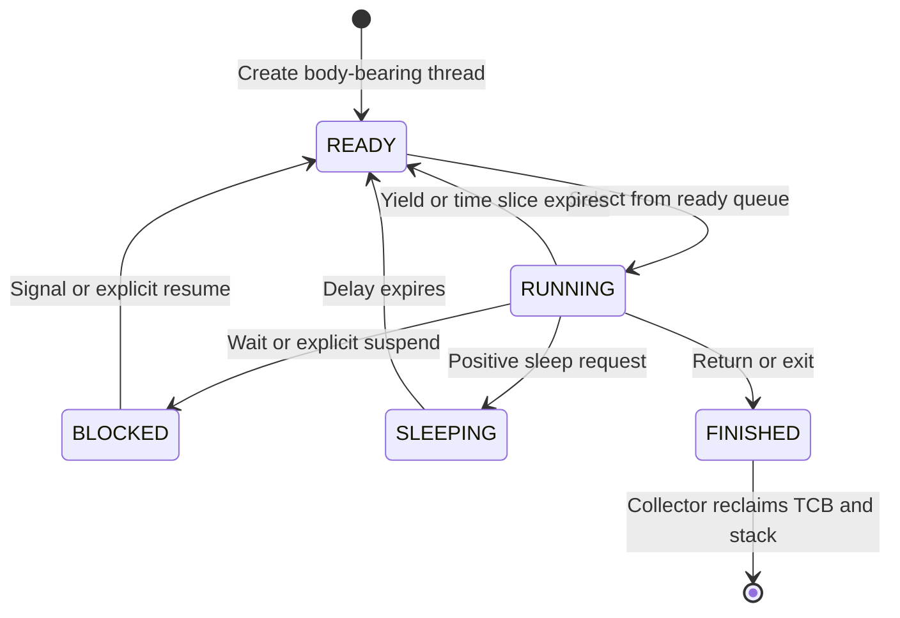

# Architecture and Execution Flow

[Documentation index](README.md) · [Repository README](../../../README.md)

## Platform and scope

The Makefile targets RV64IMA with the LP64 ABI, one QEMU `virt` CPU, and 128 MiB of RAM. The linker places the image at `0x80000000` and declares `_entry` as its entry symbol. Startup and hardware support are supplied through the course runtime libraries; the project source begins its initialization in `src/main.cpp`.

The supplied assignment describes a library-style kernel: application and kernel are statically linked and share an address space. The code implements user/supervisor privilege transitions, but no per-process address spaces or application loader. This distinction explains why raw pointers can be passed through the syscall interface.

## Components and ownership

| Component | Owns or manages | Main collaborators |
| --- | --- | --- |
| `MemoryAllocator` | Free heap regions | Platform heap boundaries |
| `SlotAllocator<T>` | Chunks of reusable object slots | `MemoryAllocator` |
| `TCB` | Thread metadata and stack | `Scheduler`, `Riscv`, slot allocator |
| `Scheduler` | Ready-queue membership | `Queue` |
| `Sem` | Permit count and blocked queue | `TCB`, `Scheduler` |
| `Timer` | Relative sleep-list membership | `TCB`, `Scheduler` |
| `BoundedBuffer` | Character array and two semaphores | `MemoryAllocator`, `Sem` |
| `MyConsole` | Receive/transmit buffer pointers | `BoundedBuffer`, hardware registers |
| `Riscv` | Trap routing and CSR operations | All kernel service classes |
| C++ API wrappers | Application-facing handles | C-style syscall wrappers |

## Boot sequence

`main()` performs these steps in order:

1. Initializes the heap allocator.
2. Writes `Riscv::supervisorTrap` to `stvec`.
3. Creates a null-body TCB representing the currently executing bootstrap context and assigns `TCB::running`.
4. Creates the supervisor-mode collector thread.
5. Allocates the console's two 1024-character buffers.
6. Creates the supervisor-mode console output thread.
7. Creates a user thread whose body calls `userMain()`.
8. Enables supervisor interrupts.
9. Repeatedly dispatches while polling the user thread's finished state.
10. Attempts to drain output, deletes the bootstrap TCB and collector, and writes the guest shutdown value.

This is the implemented sequence, not a guarantee of race-free shutdown. The collector can invalidate the polled user handle, and output emptiness is ambiguous. See [implementation notes](implementation-notes.md).

## Syscall entry and return

The C-style wrapper places the operation number in `a0` and arguments in `a1`–`a4`, then executes `ecall`. Trap entry reserves 256 bytes and saves general-purpose registers on the current thread's stack.

The C++ handler recognizes user and supervisor ecalls. It saves `sepc + 4` and `sstatus`, dispatches to the selected service, stores any return value in the saved `a0` slot, restores the saved CSRs, and returns to assembly. Assembly restores the register frame and executes `sret`.

Advancing `sepc` by four skips the `ecall` instruction on return. Interrupts instead resume at the interrupted PC and do not perform that increment.

## Blocking inside the kernel

A thread's stack holds both its application frames and its current trap-handler frames. If a semaphore wait cannot proceed, that thread becomes blocked and `TCB::dispatch` changes the running context. The suspended kernel call remains on the old stack.

```mermaid
sequenceDiagram
    participant U as User thread
    participant R as Trap handler
    participant S as Semaphore
    participant T as TCB / scheduler
    U->>R: ecall: sem_wait
    R->>S: wait(1)
    alt Permit available
        S-->>R: Consume permit; return 0
    else No permit
        S->>T: Mark blocked; queue; dispatch
        Note over S,T: The old kernel stack remains suspended
        T-->>S: Resume after another thread signals
        S-->>R: Return wait status
    end
    R-->>U: Restore saved frame; sret
```

The assembly context switch saves only `ra` and `sp` into `TCB::Context`. This works with the surrounding call/trap machinery; it must not be interpreted as a complete arbitrary-point register save by itself.

## Thread state model



This diagram shows intended normal transitions. The current suspend/resume implementation permits additional unsafe transitions and does not distinguish explicit suspension from semaphore blocking.

## Timer and scheduling

The platform timer notification arrives as supervisor software-interrupt cause 1. The handler clears SSIP, calls `Timer::tick`, and increments the running thread's time-slice counter. When the counter reaches the thread's nonzero slice, it resets the counter and dispatches. The default slice is two ticks.

The scheduler supplies FIFO ordering; it does not measure time. Sleeping threads use a separate relative-delay list. The head delay decreases once per tick, and every expired leading entry returns to the ready queue. Becoming ready is separate from being selected to run.

## Memory paths

User `mem_alloc(bytes)` and global C++ `new` enter the allocator through `ecall`. The trap handler adds metadata and rounds to 64-byte blocks. Direct kernel `kmalloc(bytes)` does the same conversion without a syscall.

`TCB::operator new` and `Sem::operator new` use specialized slot allocators. Each allocator gets chunks from the heap and scans for unused slots. Destruction releases slots, and completely empty chunks return to the heap.

The collector reclaims finished thread stacks from another thread's execution context. Application wrapper objects, user buffers, and semaphore ownership still require explicit lifetime management.

## Console flows

| Direction | Producer | Buffer | Consumer |
| --- | --- | --- | --- |
| Input | Console external-interrupt handler | `MyConsole::inputBuffer` | User `getc` syscall |
| Output | User `putc` syscall | `MyConsole::outputBuffer` | Supervisor console-output thread |

Input checks the receive-ready status bit while draining the device. Output removes a buffered byte, polls transmit readiness, and writes the device register. This is buffered I/O with polling at the hardware boundary.

## Concurrency assumptions

The build configures one CPU. Trap entry masks supervisor interrupts until the return path restores them, so many syscall operations are serialized in that context. However, direct supervisor-thread operations also access shared structures, and some run with interrupts enabled. The allocators, intrusive queue, and ring indices contain no general lock.

Therefore “single CPU” and “uses semaphores” are not sufficient to claim every kernel data structure is safe against preemption. The [class references](README.md) state the relevant caller contracts; [implementation notes](implementation-notes.md) identify the remaining hazards.
